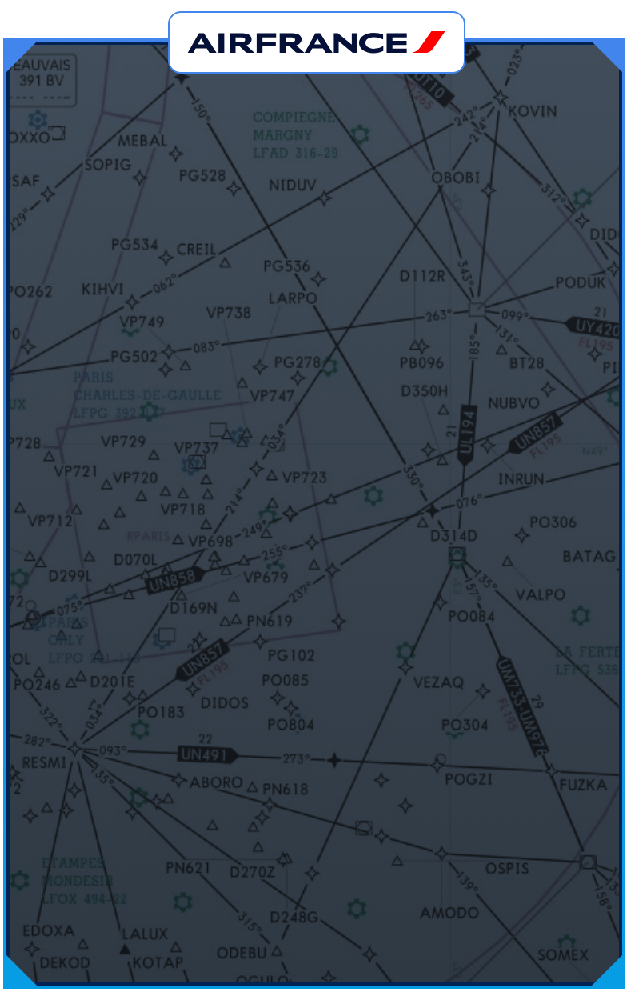

# stream-navi-overlay

Overlay Twitch/OBS pour le streaming de simulateur de vol (Microsoft Flight Simulator + Navigraph), affichant une carte de navigation et le logo de la compagnie aerienne en cours de vol.



## Fonctionnement

- **Carte de navigation** en fond d'ecran (`img/map.jpg`), avec cadre degrade bleu/cyan et coins decoupes.
- **Bandeau compagnie** : affiche automatiquement le logo de la compagnie aerienne correspondant au CALLSIGN du vol en cours.
- **Detection automatique** via [StreamFlight](https://flightsim.to/addon/98415/streamflight-your-obs-streaming-companion), le compagnon de stream OBS pour MSFS : l'overlay lit en continu le fichier `callsign.txt` genere par StreamFlight et en deduit la compagnie (ex. `AFR1234` -> Air France).
- **Ecran transparent optionnel** (`?ecran=transparent`) pour incruster une capture de fenetre Navigraph a la place de la carte statique, directement dans OBS.
- **Mode manuel** (`?cie=AFR`) pour forcer une compagnie en test, sans dependre de StreamFlight.

Aucun framework front : HTML / SCSS / JS natif, buildes avec Bun + Vite.

## Stack technique

- [Bun](https://bun.sh) comme gestionnaire de paquets et runtime de script
- [Vite](https://vite.dev) pour le dev server et le build
- SCSS (Dart Sass) pour les styles
- [vite-plugin-singlefile](https://github.com/richardtallent/vite-plugin-singlefile) : le build produit un **unique `dist/index.html` autonome** (JS/CSS/images inlines), indispensable pour une source navigateur OBS en "Fichier local" (`file://`)

## Demarrage

```bash
bun install
bun run dev      # serveur de developpement avec rechargement a chaud
```

## Build pour OBS

```bash
bun run build     # genere dist/index.html (autonome)
```

Dans OBS : **Sources > + > Source navigateur**, cocher **Fichier local**, pointer sur `dist/index.html`, largeur `392`, hauteur `625` (a multiplier par la variable `--scale` si elle est modifiee dans `scss/_variables.scss`).

## Structure du projet

```
index.html            point d'entree (Vite)
scss/
  overlay.scss         assemble les partials via @use
  _variables.scss       custom properties CSS (couleurs, echelle, geometrie)
  _reset.scss            reset html/body
  _screen.scss           ecran (fond dégrade + carte + mode transparent)
  _frame.scss             cadre, coins
  _badge.scss             bandeau logo compagnie
js/
  overlay.js            logique d'affichage + suivi StreamFlight
img/
  map.jpg               carte de navigation (fond d'ecran)
public/
  logos/                logos des compagnies, copies tels quels dans dist/
scripts/
  screenshot.mjs         capture Playwright du rendu (voir plus bas)
docs/
  preview.png            capture utilisee dans ce README
```

## Compagnies et logos

La liste des compagnies se configure dans `js/overlay.js` (objet `COMPAGNIES`), avec le prefixe ICAO du callsign comme cle :

```js
var COMPAGNIES = {
  AFR: { nom: "Air France", logo: "air-france.svg" },
  TVF: { nom: "Transavia", logo: "transavia.svg" },
  EZY: { nom: "easyJet", logo: "easyjet.svg" },
  RYR: { nom: "Ryanair", logo: "ryanair.svg" },
  VLG: { nom: "Vueling", logo: "vueling.svg" }
};
```

Chaque logo doit exister dans `public/logos/` (PNG ou SVG, fond transparent). Si le fichier est absent ou que le code ne correspond a aucune compagnie, le bandeau se masque simplement (pas de texte de repli).

## Detection automatique via StreamFlight

1. Dans StreamFlight, regler le dossier **Output** sur le **meme dossier** que `dist/index.html`.
2. L'overlay lit `callsign.txt` dans ce dossier toutes les 2 secondes et en deduit la compagnie.
3. Le nom exact du fichier n'est pas documente officiellement par StreamFlight ; `callsign.txt` est la convention la plus probable (coherente avec les autres fichiers qu'il genere : `flight_phase.txt`, `vspeed.txt`...). A corriger dans `STREAMFLIGHT_FICHIER` (`js/overlay.js`) si different chez toi.

## Test manuel sans StreamFlight

Ajouter `?cie=CODE` a l'URL de la source navigateur desactive le suivi StreamFlight pour la session :

```
file:///C:/overlay-navi/dist/index.html?cie=AFR
```

## Incruster Navigraph a la place de la carte

1. Ajouter `?ecran=transparent` a l'URL de cette source navigateur (cumulable avec `?cie=`) : la carte et le fond degrade de l'ecran disparaissent, seuls le cadre/coins/badge restent visibles.
2. Ajouter une source **Capture de fenetre** pour Navigraph dans OBS, recadree et positionnee a la main sur le rectangle de l'ecran (`left: 4px`, `top: 26px`, `385 x 590 px`, multiplie par `--scale`).
3. Dans la liste des sources OBS, placer cette Capture de fenetre **en dessous** de la source navigateur de l'overlay.

L'affichage/masquage de cette capture selon que Navigraph tourne ou non reste manuel : une source navigateur en bac a sable ne peut pas detecter le lancement d'une autre application.

## Screenshot automatique (CI)

Le fichier `docs/preview.png` (utilise en haut de ce README) est regenere automatiquement par le workflow [`.github/workflows/screenshot.yml`](.github/workflows/screenshot.yml) a chaque push sur `main` : build de l'overlay, capture avec [Playwright](https://playwright.dev), puis commit de l'image si le rendu a change.

Pour le generer en local :

```bash
bun run build
bun run screenshot   # ecrit docs/preview.png
```

> Le workflow a besoin des permissions d'ecriture du `GITHUB_TOKEN` pour committer la capture : verifier **Settings > Actions > General > Workflow permissions > Read and write permissions** sur le depot.
